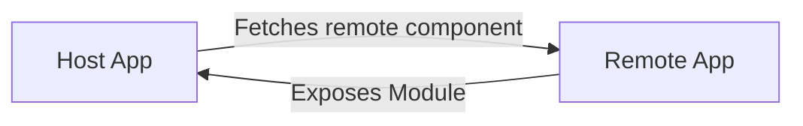

🟦 **Modern Frontend Architecture** _From Microfrontends to Web Components_

## 🟦 — The Problem

- Frontend apps are getting bigger and more complex
- Multiple teams working on the same application
- Hard to scale and maintain
- Deployment becomes risky

👉 How can we solve this?

---

## 🟦 — Microfrontend Concept

**What is Microfrontend?**

- Architecture that splits frontend into smaller apps
- Each part is independent
- Teams can build & deploy separately

👉 Like microservices… but for frontend

---

## 🟦 — Microfrontend Benefits

- ✅ Team independence
- ✅ Independent deployments
- ✅ Scalability
- ✅ Technology flexibility

---

## 🟦 — The Integration Challenge

**Problem:**

How do we combine multiple frontend apps in one UI?

**Common solutions:**

- Module Federation
- iFrames
- Web Components

---

## 🟦 — Module Federation Setup

Core feature in Webpack 5



## 🟦 — Web Components Introduction

**What are Web Components?**

- Native browser standard
- Build reusable custom HTML elements

```html
<user-card></user-card> <product-list></product-list>
```

---

## 🟦 — Web Components Core Concepts

- **Custom Elements** → define your own tags
- **Shadow DOM** → style & DOM isolation
- **Templates** → reusable structure

---

## 🟦 — Why Web Components?

- Framework-agnostic
- Reusable across apps
- Encapsulated (no CSS conflicts)

👉 Perfect for Microfrontends

---

## 🟦 — The Problem with Native Web Components

- ❌ Verbose APIs
- ❌ Boilerplate code
- ❌ No reactivity out of the box
- ❌ Hard to scale in large projects

---

## 🟦 — Stencil JS

**Stencil JS**

- A compiler for building Web Components
- Uses modern developer experience
- Outputs standard Web Components

👉 Output = Pure Web Components

---

## 🟦 — Why Stencil?

### Developer Experience

- JSX syntax
- TypeScript support
- Reactive props & state

### Performance

- Lazy loading
- Small runtime
- Optimized bundles

## 🟦 — References

- [Web Components](https://developer.mozilla.org/en-US/docs/Web/API/Web_components)
- [Stencil JS](https://stenciljs.com/)
- [Lerna](https://lerna.js.org/)
- ["Nice to read" regarding the styling](https://frontendmasters.com/blog/a-modest-web-components-styling-proposal-an-i-know-what-im-doing-selector/)
- [Module Federation](https://module-federation.io/)
